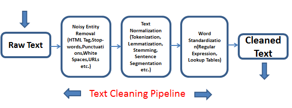
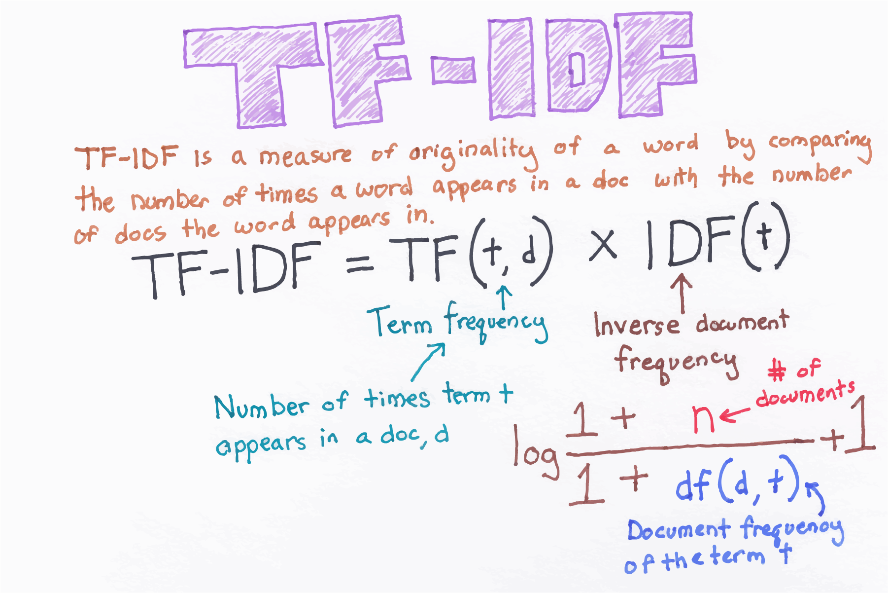
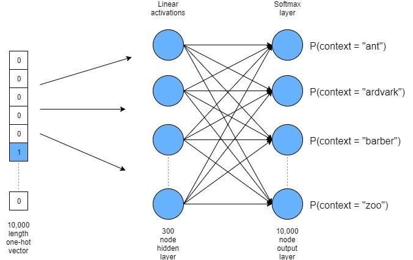
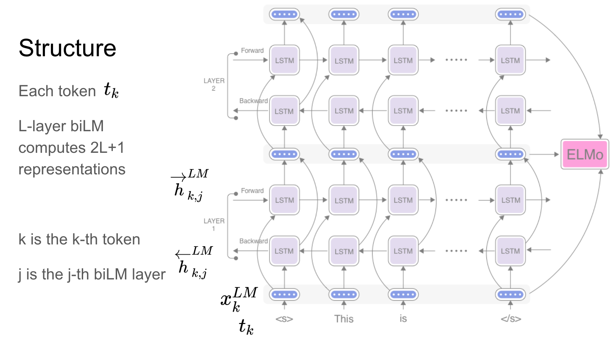

<h3>Introduction</h3>
Three models are built to classify sentence vectors with multiple classes using various Deep Learning Techniques.
For now, two baseline models are using TF-IDF and  word2vec embeddings, and one proposed model, which is build using ELMO (Embeddings from Language Models).
Let's look into the given files in more detail.

<h3>Setup</h3>

Right after cloning the repository create the environment by `python -m venv env`   
Then activate the source by running:   
On macOS and Linux: `source env/bin/activate`  or    
On Windows: `.\env\Scripts\activate`    
To install dependencies run `pip install -r requirements.txt` 

<h3>Data</h3>
There are two data files:

1. <b>training.xlsx</b> > used as training data
2. <b>testing.xlsx</b>  > used as testing data

<h3>Text Pre-processingr</h3>

Read more about <b>Text Pre-processing</b> [here](https://towardsdatascience.com/text-preprocessing-in-natural-language-processing-using-python-6113ff5decd8#:~:text=In%20NLP%2C%20text%20preprocessing%20is,Stop%20words%20removal)   

In this repository, you will find <b>textprep.py</b>, which contains all the text pre-processing steps and is imported by all other python files here.  
This python script also contains all the necessary NLTK packages and will be downloaded automatically. 

<h3>Baseline TF-IDF Vectorizer Model </h3>

Read more about <b>TF-IDF</b> [here](https://medium.com/@cmukesh8688/tf-idf-vectorizer-scikit-learn-dbc0244a911a)   

For this model, respective files are as follow:

1.<b>tfidf_train.py:</b> It will preprocess the text, it will get TF-IDF vector, create and save labels for the dependent variable, train the neural network, and will save the model in the current directory. 
To run it `python tfidf_train.py`

2.<b>tfidf_test.py:</b> It will preprocess the text, it will load the saved vector, load the trained model, perform predictions, and will create the result output file(testing_result_testidf.csv). 
To run it `python tfidf_test.py`

<h3>Baseline Word2Vec Model </h3>

Read more about <b>Word2Vec</b> [here](https://towardsdatascience.com/introduction-to-word-embedding-and-word2vec-652d0c2060fa)   

For this model, respective files are as follow:

1.<b>word2vec_train.py:</b> It will preprocess the text, it will get sentence vector by averaging out word vectors and save it as embeddings, create and save labels for the dependent variable, train the neural network, and will save the model in the current directory. 
To run it `python tfidf_train.py`  
<b> Note :</b> Before running train file you to download `glove.6B.50d.txt` file. Download from [here](https://nlp.stanford.edu/projects/glove/)

2.<b>word2vec_test.py:</b> It will preprocess the text, it will load the embeddings, load the trained model, perform predictions, and will create the result output file(testing_result_word2vec.csv). 
To run it `python word2vec_test.py`

<h3>Proposed ELMO Model </h3>

Read more about <b>ELMo (Embeddings from Language Models)</b> [here](https://www.analyticsvidhya.com/blog/2019/03/learn-to-use-elmo-to-extract-features-from-text/)   

For this model, respective files are as follow:

1.<b>elmo_train.py:</b> It will preprocess the text, it will download the Elmo model from the TensorFlow hub, create and save labels for the dependent variable, will train bidirectional LSTM model using Elmo embeddings, and will save the model in the current directory. 
To run it `python elmo_train.py` 

2.<b>elmo_test.py:</b> It will preprocess the text, it will take the embeddings from the loaded Elmo model, load the trained model, perform predictions, and will create the result output file(testing_result_elmo.csv). 
To run it `python elmo_test.py`  

<b> We saw ELMO performes better than the other two models(TF-IDF vectorization and Word2vec).</b>  

<b> Next we will try use BERT model for sentence classification.</b>   
  
Read more about <b>BERT</b> [here](https://towardsdatascience.com/bert-explained-state-of-the-art-language-model-for-nlp-f8b21a9b6270)     

<b>Created by :</b>
<b><i> Anubhav Shukla </i></b>
 
 

